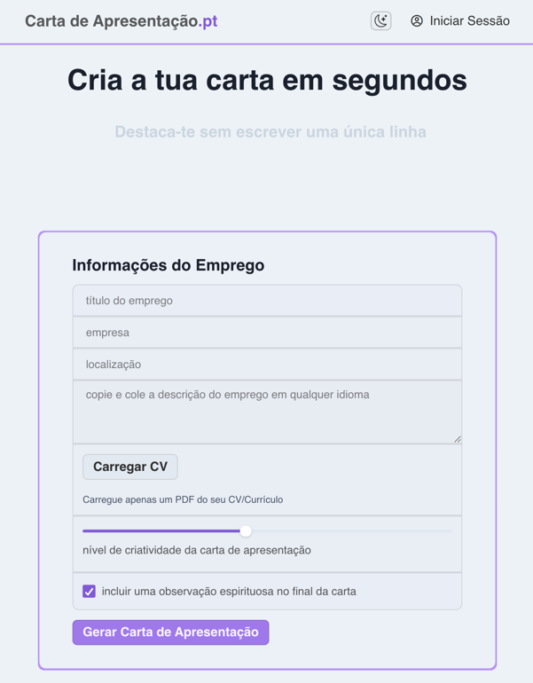

# CoverLetterGPT.xyz



## Running it locally
After cloning this repo, you can run it locally by following these steps:

1. Install [Wasp](https://wasp.sh) by running `curl -sSL https://get.wasp-lang.dev/installer.sh | sh` in your terminal.
2. Create a `.env.server` file in the root of the project
3. Copy the `env.server.example` file contents to `.env.server` and fill in your API keys
4. Make sure you have a Database connected and running. Here are two quick options:
  - run `wasp start db` from the project root. You need to have Docker installed (if not, on MacOS run `brew install docker-machine docker` and start the Docker app). This will start a Postgres database and configure it for you. No need to do anything else!
  - or provision a Postgres database on [Railway](https://railway.app) or [Neon](https://neon.tech), go to settings and copy the connection url. Paste it as DATABASE_URL=<your-postgres-connection-url> into your env.server file.
5. Run `wasp db migrate-dev`
6. Run `wasp start`
7. Go to `localhost:3000` in your browser (your NodeJS server will be running on port `3001`)
8. install the [Wasp extension for VSCode](https://marketplace.visualstudio.com/items?itemName=wasp-lang.wasp) for the best DX

## Deploying to Railway
We will show how to deploy the client, the server, and provision a database on Railway.

Railway is a simple and great way to host your server and database. It's also possible to deploy your entire app: database, server, and client. You can use the platform for free for a limited time, or if you meet certain eligibility requirements. See their [plans page](https://docs.railway.app/reference/pricing/plans) for more info.


### Prerequisites
To get started, follow these steps:

1. Make sure your Wasp app is built by running `wasp build` in the project root directory.
2. Create a [Railway](https://railway.app) account


> 💡 Free Tier
> 
> Sign up with your GitHub account to be eligible for the free tier


3. Install the Railway CLI
4. Run `railway login` and a browser tab will open to authenticate you.

### Create New Project
Let's create our Railway project:

1. (**Skip if you're using Neon**) Go to your Railway dashboard, click on New Project, and select `Deploy PostgreSQL` from the dropdown menu.
2. Once it initializes, right-click on the `New` button in the top right corner and select `Empty Service`.
3. Once it initializes, click on it, then click on the name of the service on top, and change the name to `server
4. Go ahead and create another `Empty Service` and name it `client`

### Deploy Your App to Railway

#### Setup Domains

We'll need the domains for both the `server` and `client` services:

1. Go to the `server` instance's `Settings` tab, and click `Generate Domain`.
2. Do the same under the `client`'s `Settings`.

Copy the domains as we will need them later.

#### Deploying the Server

Let's deploy our server first:

1. Move into your app's `.wasp/build/` directory:

```shell
cd .wasp/build
```

2. Link your app build to your newly created Railway project:

```shell
railway link
```

<!-- TOPIC: env vars -->

3. Go into the Railway dashboard and set up the required env variables:

   Open the `Settings` and go to the `Variables` tab:

    - click **Variable reference** and select `DATABASE_URL` (it will populate it with the correct value)
    - add `WASP_WEB_CLIENT_URL` - enter the `client` domain (e.g. `https://client-production-XXXX.up.railway.app`). `https://` prefix is required!
    - add `WASP_SERVER_URL` - enter the `server` domain (e.g. `https://server-production-XXXX.up.railway.app`). `https://` prefix is required!
    - add `JWT_SECRET` - enter a random string at least 32 characters long (use an [online generator](https://djecrety.ir/))

>:::tip Using an external auth method? If your app is using an external authentication method(s) supported by Wasp (such as Google or GitHub), make sure to additionally set the necessary environment variables specifically required by these method(s). :::
   

4. Push and deploy the project:

```shell
railway up
```

Select `server` when prompted with `Select Service`.

Railway will now locate the Dockerfile and deploy your server 👍

#### Deploying the Client

1. Next, change into your app's frontend build directory `.wasp/build/web-app`:

```shell
cd web-app
```

2. Create the production build, using the `server` domain as the `REACT_APP_API_URL`:

```shell
npm install && REACT_APP_API_URL=<url_to_wasp_backend> npm run build
```

3. Next, we want to link this specific frontend directory to our project as well:

```shell
railway link
```

<!-- TOPIC: client deployment -->

4. We need to configure Railway's static hosting for our client.

   :::info Setting Up Static Hosting

   Copy the `build` folder within the `web-app` directory to `dist`:

   ```shell
   cp -r build dist
   ```

   We'll need to create the following files:

    - `Dockerfile` with:

      ```Dockerfile title="Dockerfile"
      FROM pierrezemb/gostatic
      CMD [ "-fallback", "index.html" ]
      COPY ./dist/ /srv/http/
      ```

    - `.dockerignore` with:
      ```bash title=".dockerignore"
      node_modules/
      ```

   You'll need to repeat these steps **each time** you run `wasp build` as it will remove the `.wasp/build/web-app` directory.

   <details>
   <summary>
   Here's a useful shell script to do the process
   </summary>

   If you want to automate the process, save the following as `deploy_client.sh` in the root of your project:

   ```bash title="deploy_client.sh"
   #!/usr/bin/env bash

   if [ -z "$REACT_APP_API_URL" ]
   then
     echo "REACT_APP_API_URL is not set"
     exit 1
   fi

   wasp build
   cd .wasp/build/web-app

   npm install && REACT_APP_API_URL=$REACT_APP_API_URL npm run build

   cp -r build dist

   dockerfile_contents=$(cat <<EOF
   FROM pierrezemb/gostatic
   CMD [ "-fallback", "index.html" ]
   COPY ./dist/ /srv/http/
   EOF
   )

   dockerignore_contents=$(cat <<EOF
   node_modules/
   EOF
   )

   echo "$dockerfile_contents" > Dockerfile
   echo "$dockerignore_contents" > .dockerignore

   railway up
   ```

   Make it executable with:

   ```shell
   chmod +x deploy_client.sh
   ```

   You can run it with:

   ```shell
   REACT_APP_API_URL=<url_to_wasp_backend> ./deploy_client.sh
   ```

   </details>
   :::

5. Set the `PORT` environment variable to `8043` under the `Variables` tab.

6. Once set, deploy the client and select `client` when prompted with `Select Service`:

```shell
railway up
```

#### Conclusion

And now your Wasp should be deployed! 🐝 🚂 🚀

Back in your [Railway dashboard](https://railway.app/dashboard), click on your project and you should see your newly deployed services: PostgreSQL, Server, and Client.

### Updates & Redeploying

When you make updates and need to redeploy:

- run `wasp build` to rebuild your app
- run `railway up` in the `.wasp/build` directory (server)
- repeat all the steps in the `.wasp/build/web-app` directory (client)


## How it works

[coverlettergpt.xyz](http://coverlettergpt.xyz) was built in a couple of days using a few really cool tools:

- 🐝 [Wasp](https://wasp.sh) - allows you to build full-stack apps with 10x less boilerplate
- 🎨 [Chakra-ui](https://chakra-ui.com/) - UI components for React that look good and are easy to work with
- 🤖 [OpenAI](https://openai.com/) - GPT-4o API
- 💸 [Stripe](https://stripe.com/) - for payments
- ⚡️ [Lightning / Bolt11](https://github.com/bitcoinjs/bolt11) - for Bitcoin Lightning payments

[Wasp](https://wasp.sh) as the full-stack framework allows you to describe your app’s core features in the `main.wasp` config file in the root directory. Then it builds and glues these features into a React-Express-Prisma app for you so that you can focus on writing the client and server-side logic instead of configuring. For example, I did not have to use any third-party libraries for Google Authentication. I just wrote a couple lines of code in the config file stating that I want to use Google Auth, and Wasp configures it for me. Check out the `main.wasp` file for more.

Also, [Chakra-ui](https://chakra-ui.com/) is great for building nice looking UI’s really quickly and easily. Some people are turned off by the fact that they’re React components, but I find that they’re easy to customize and configure, and get me started on designs 10x faster and with less code than tailwind.

For more info on the prompts and configuration I used for the [OpenAI](https://openai.com/) API, check out the `src/server/actions.ts` file.

[Stripe](https://stripe.com/) makes the payment functionality super easy. I configure two subscription products, one for GPT-3.5 turbo and another for GPT-4. After the user pays, I update their `hasPaid` and `datePaid` fields in the database.

[Lightning / Bolt11](https://github.com/bitcoinjs/bolt11) is a great library for working with Bitcoin Lightning payments. I used it to generate a Lightning invoice for the user to pay. After the user pays, I update their `LnPayment.status` field in the database (see `src/server/ln.ts`), which allows the user to perform a generation on the front-end. I personally accept the payments to my [Alby](https://getalby.com/) lightning address.

I also implemented a cron job to send an email to the user to notify them 2 weeks before their subscription ends. I used [SendGrid](https://sendgrid.com/) for the email service.

If you have any other questions, feel free to reach out to me on [twitter](https://twitter.com/hot_town)
